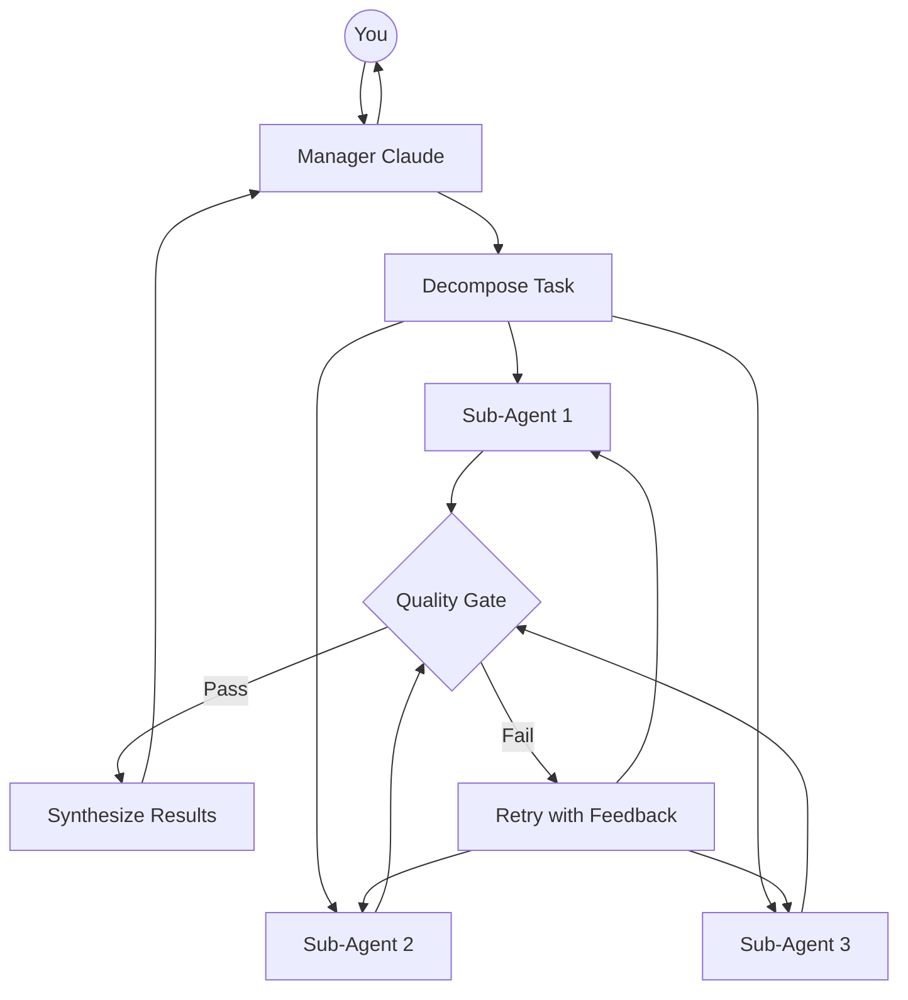
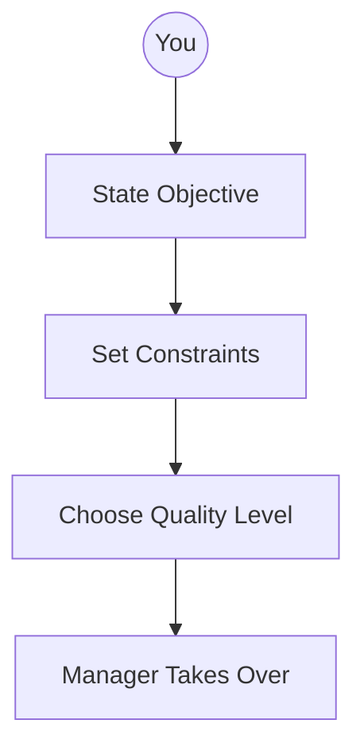
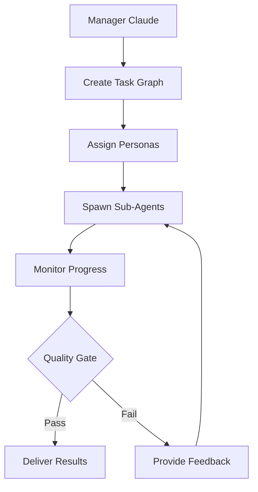
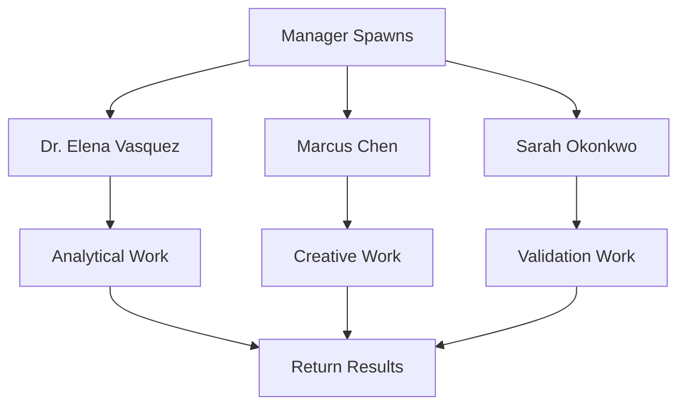
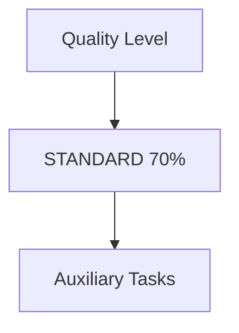
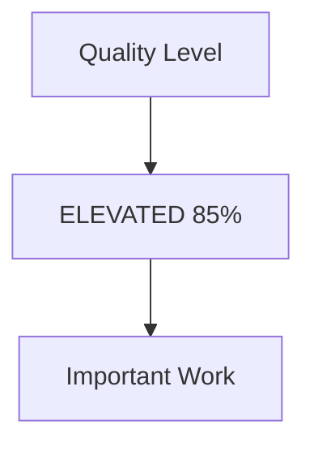
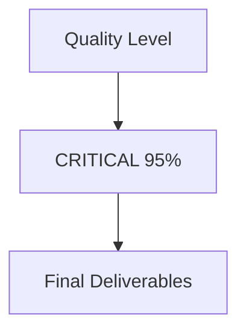
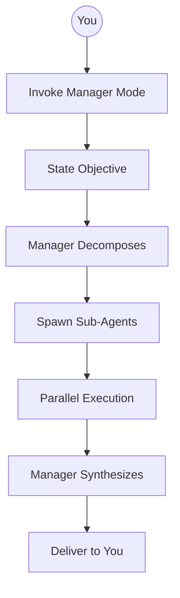

# How Dispatcher-Manager Works

> **Note:** This document contains Mermaid diagrams. For best results, view in Obsidian, VS Code, or GitHub.

## Overview

The Dispatcher-Manager pattern transforms Claude into a project manager that delegates work to specialized sub-agents rather than doing everything itself.

## The Three-Tier Model

### Tier 1: You (The Executive)

### Tier 2: Manager (Claude as Orchestrator)

### Tier 3: Sub-Agents (Specialized Workers)

## Quality Thresholds

The manager enforces quality based on task importance:

## Persona Library

Each persona has specialized strengths:

| Persona | Specialty | Use For |
|---------|-----------|---------|
| Dr. Elena Vasquez | Analytical | Research, data analysis |
| Marcus Chen | Creative | Ideation, breakthroughs |
| Sarah Okonkwo | Validation | QA, finding flaws |
| Dr. James Liu | Research | Exhaustive coverage |
| Dr. Maya Patel | Synthesis | Cross-domain connections |
| Jack Morrison | Copywriting | Direct response |

## Invocation Flow

## Key Benefits

1. **Isolated Context** - Sub-agents don't pollute the main conversation
2. **Parallel Work** - Multiple tasks run simultaneously
3. **Quality Control** - Built-in gates prevent poor output
4. **Specialized Personas** - Right expert for each task

---

*Generated for Dispatcher-Manager Agent documentation*
