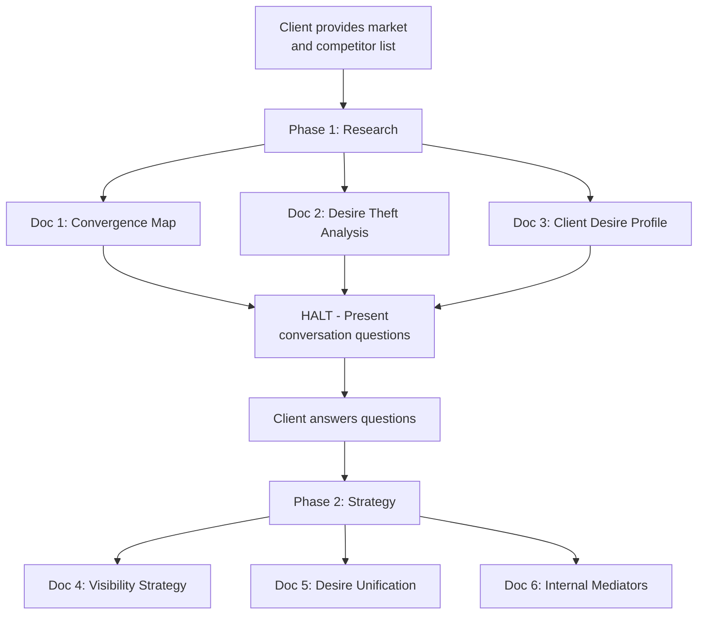
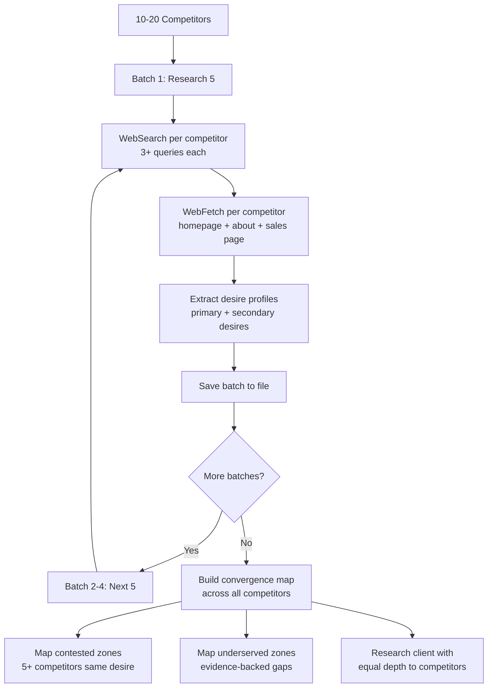
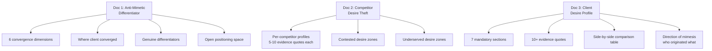
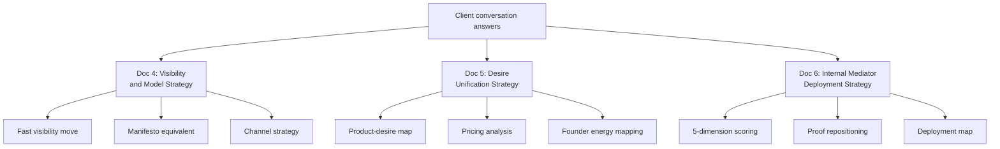
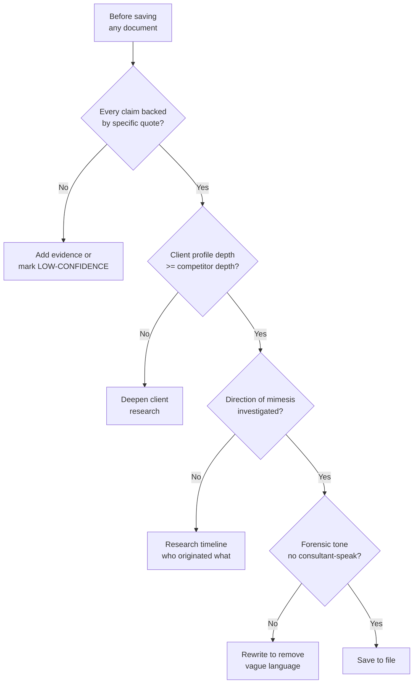
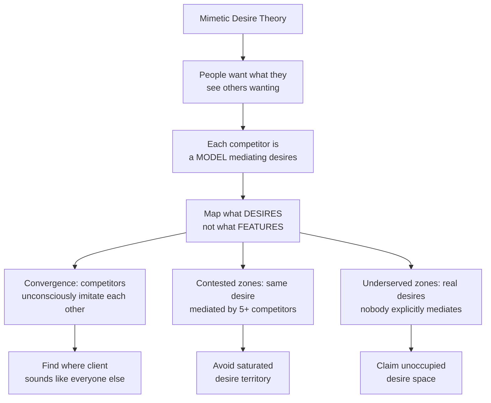

# How Mimetic Market Intelligence Works

Visual diagrams showing the skill architecture and data flow.

---

## Overview: Two-Phase Process

---

## Phase 1: Research Engine

---

## Phase 1 Output: The Three Documents

---

## Phase 2: Strategy Documents

---

## Quality Gates

---

## Girardian Framework

